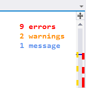

Error Watcher
================

This is the home of the Visual Studio extension "Error Watcher".

Download from the [VS Gallery](http://visualstudiogallery.msdn.microsoft.com/a85f155f-b519-44a8-b56b-07611cf78393)
or get the [nightly build](http://vsixgallery.com/extension/0798393f-f7b0-4283-a36e-c57a73f031c4/).

Sometimes it can be hard to tell if the file you're editing
contains errors. Perhaps the error is all the way to the bottom
of the file and you don't notice it. You might save the file
containing the error and something bad happens when you then
try to run your application.

Here's how it works:

1. Displays errors at the top right corner of the editor
2. Displays both the number of Errors, Warnings and Messages
3. Flashes quickly if the file contains Errors when you save the file
4. Click on the in-editor error list to open the Visual Studio Error List